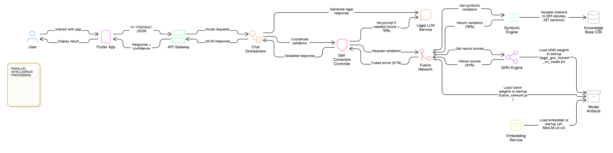
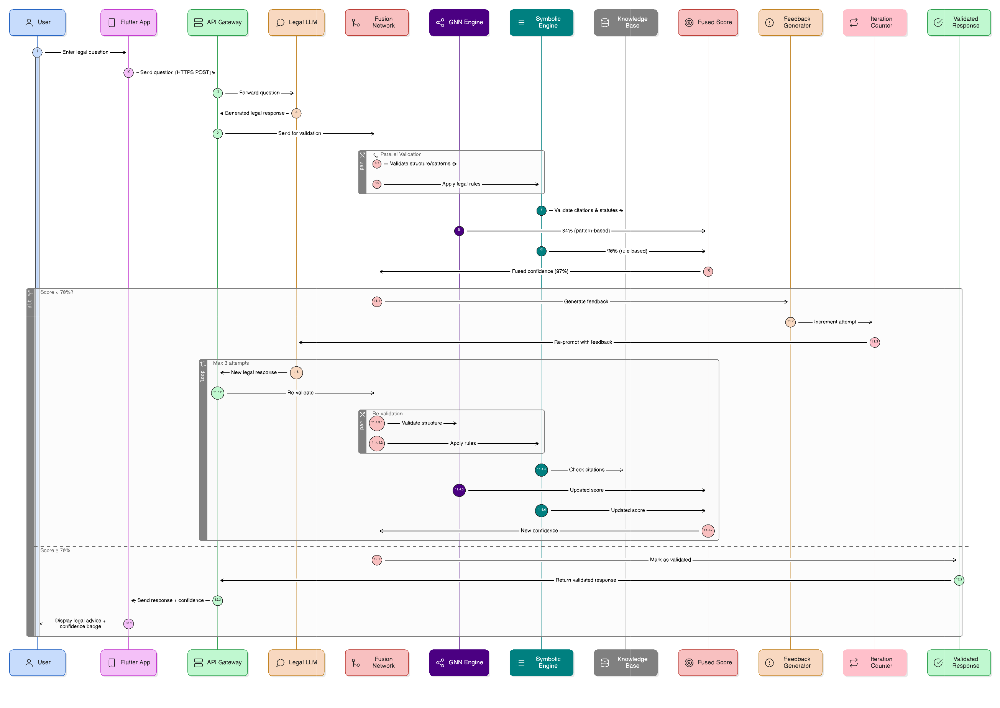

# Lexium Mobile

## This is a Mobile app Integrated with Neurosymbolic AI, focused on giving legal information for general public.

This project gives high accuracy legal information to the general public who has no clear idea about the legal sector.This also gives how accurate those information as a percentage.The work done are as follows;

* Creating a GNN trained using legal corpus.
* Creating a symbolic system made using 10 hard-coded rules.
* Creating a mobile app inteface

The work to be done as follows;

* Integration with flask API
* Backend for the mobile app to connect with the legal data trained chat-bot.
* Neural Network.
* Backend for the mobile app to connect with the Fusion Neural Network. 

## System Architecture Diagram



## Flow Diagram



## How to install

### Prerequisites

- Python 3.8 or higher
- pip (Python package manager)
- Flutter sdk
- VS Code
- Android Emulator/Physical Device

### Quick Start

### 1. Clone the Repository

```bash
git clone https://github.com/DhyanMohottie/Lexora
cd lexium_mobile_backend
```

### 2. Create Virtual Environment (Recommended)

**Windows:**
```bash
python -m venv venv
venv\Scripts\activate
```

**Mac/Linux:**
```bash
python3 -m venv venv
source venv/bin/activate
```

### 3. Install Dependencies

All dependencies are in `requirements.txt`

```bash
pip install -r requirements.txt
```

##  Dependencies
### Core Dependencies

**Core Deep Learning**


torch==2.2.2

**Graph Neural Networks**


torch-geometric==2.7.0
torch-scatter>=2.1.0
torch-sparse>=0.6.18

**NLP & Embeddings**


sentence-transformers==5.2.0
transformers>=4.30.0
tokenizers>=0.13.0
huggingface-hub>=0.16.0
safetensors>=0.3.0

**Data Science**


numpy==2.4.1
pandas==2.3.3
scikit-learn>=1.3.0
scipy>=1.10.0


**Web Framework**


Flask>=3.0.0
Flask-CORS>=4.0.0
Flask-JWT-Extended>=4.5.0


**Utilities**


tqdm>=4.66.0
requests>=2.31.0
python-dotenv>=1.0.0

### 4. Run Tests

### Test 1: Run GNN Test
```bash
python test_gnn.py
```

**Expected output:**
```
Loading GNN model from: legal_gnn_trained_no_cases.pt
 Loaded checkpoint with 10 edge types
 Model loaded successfully!
   Node types: ['document', 'statute', 'section', 'claim']
   Edge types: 10 total
Overall Score: score%
Validity: validity%
Relevance: relevance%
Coherence: coherence%
```

### Test 2: Run Symbolic Test
```bash
python test_real_data.py
```

**Expected output:**
```
Test 1: The defendant violated Section 2 of the Service Contracts Ordinance as established in precedent
Score: 70.0%
Valid: True
Passed: 7/10 rules

Test 2: The plaintiff's claim under the Bribery Act and Section 10 is well-founded
Score: 90.0%
Valid: True
Passed: 9/10 rules

Test 3: Based on the Animals Act and Section 4, the court must rule in favor
Score: 90.0%
Valid: True
Passed: 9/10 rules
```

## How to test different input's with the GNN and symbolic reasoning system

Replace the claim of the test_gnn.py with a different sentence/word.
    eg:-"The defendant violated Section 2 of the Service Contracts Ordinance" with "I went for a walk"

Replace a single or multiple claims of the test_real_data.py with a different sentence/word.

    eg:-"The defendant violated Section 2 of the Service Contracts Ordinance as established in precedent" with "abkjnlklnlkqd"
    
    AND
    
    "The plaintiff's claim under the Bribery Act and Section 10 is well-founded" with "I drank water"


### 5.Navigate to Mobile app

```bash
cd ..
```
```bash
cd lexium_mobile
```

### 6.Get Dependencies

```bash
flutter pub get
```

### 7.Run App

```bash
flutter run
```
